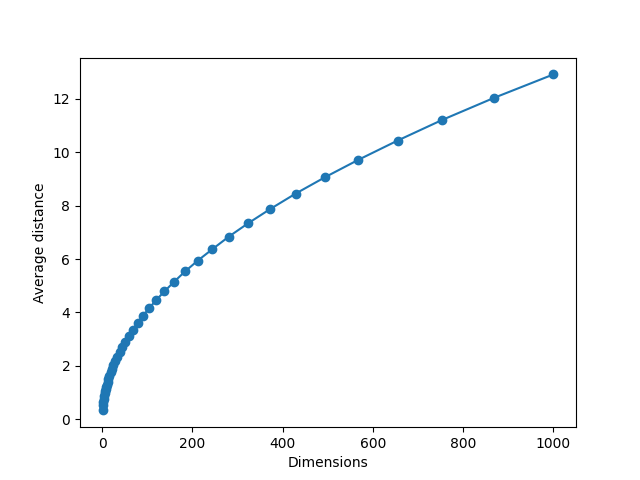

# Average Distance in n-dimensional cuboid

Calculates the average difference between 2 random points in a random cuboid with edge length 1 with a Monte-Carlo numpy simulation.

# Examples: 
## In 1 dimensions: 
A = random between 0 and 1  
B = random between 0 and 1  
X = distance(A, B) <- result  

# Graph for many dimensions
