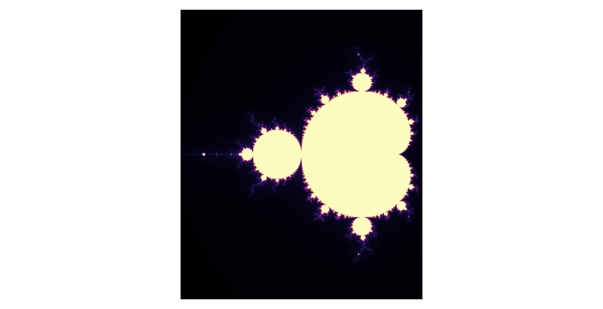

# Mandelbrot
(wip)
Most Mandelbrot set python projects online don't let users do the most fun thing about fractals: zoom in!

This aims to let users zoom in indefinitely and get higher and higher resolutions.

